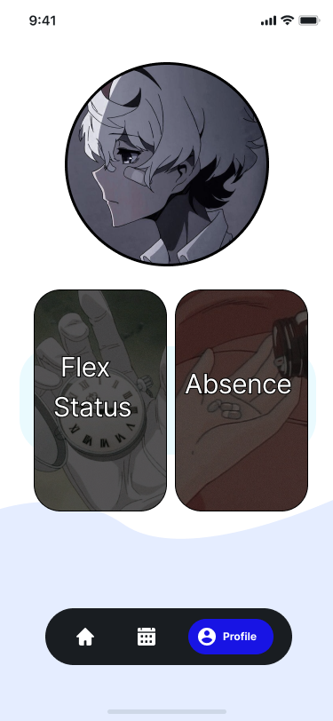
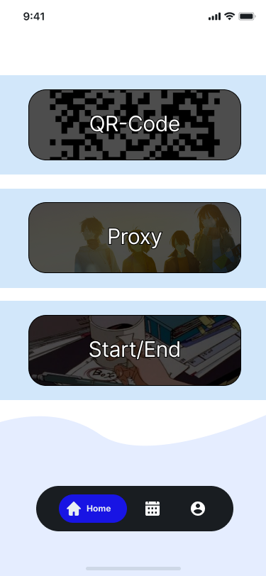
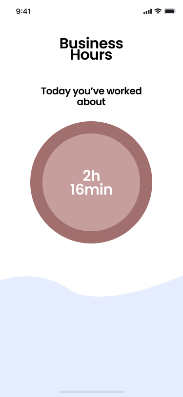
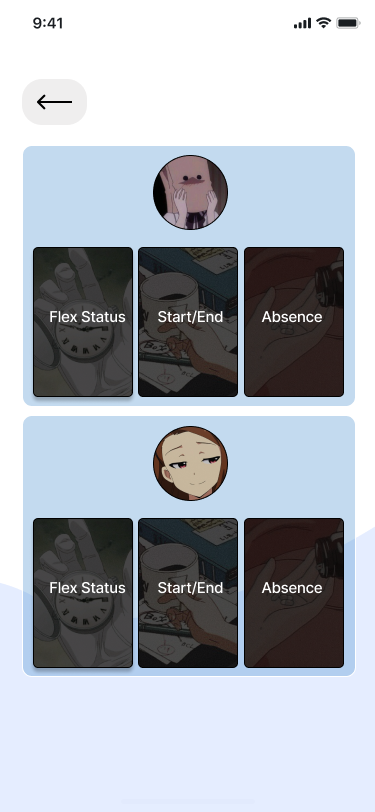
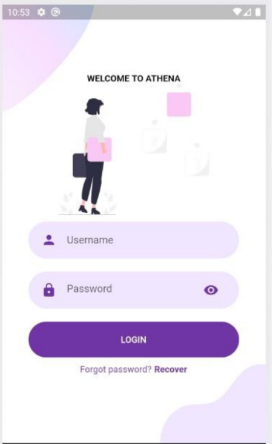

# ATHENA 

Work-Hour Tracking mobile application written on Flutter	

**Goals**
----------

Athena's goal is to give users the ability to track work time both remotely and physically

**Team Members**
----------

-	Nurzhan Momynkul  190107062@stu.sdu.edu.kz
-	Iskandar Rassulov 190107061@stu.sdu.edu.kz
-	Nurdaulet Seitkulov 190107097@stu.sdu.edu.kz 
-	Nurkhat Tugelbayev 190107080@stu.sdu.edu.kz

**Scope and Features**  
----------

•	Simple Work-Hour Tracker 
•	User-friendly interface

**Solution concept**
----------

-	Installing AndroidStudio client and SDK's on our locally for familiarization
-	Developing and testing on Flutter
-	Testing the current widgets on Flutter
-	Building a simple on Flutter apps
-	Using navigations and interactivities
-	Automating the tuning of our model
-	Learing an objects which representing a delayed computation.

 _map.jpg)

**Acceptance Criteria**
----------
Developing a project on Dart Flutter every week we trying to modify and upgrade our project according to CSS 342 Software Engineering course

 
 
 
  
 
 
